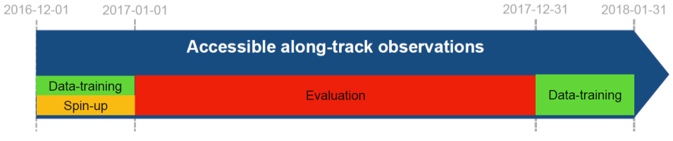

[](https://doi.org/10.5281/zenodo.5511905)

# SSH Mapping Data Challenge 2021a

This repository contains codes and sample notebooks for downloading and processing the SSH mapping data challenge.

The quickstart can be run online by clicking here:
[](https://binder.pangeo.io/v2/gh/ocean-data-challenges/2020a_SSH_mapping_NATL60/master?filepath=quickstart.ipynb)

## Motivation

The goal is to investigate how to best reconstruct sequences of Sea Surface Height (SSH) maps from partial satellite altimetry observations. This data challenge follows an _Observation System Experiment_ framework: Satellite observations are from real sea surface height data from altimeter. The practical goal of the challenge is to investigate the best mapping method according to scores described below and in Jupyter notebooks.

### Observations
The SSH observations include SARAL/Altika, Jason 2, Jason 3, Sentinel 3A, Haiyang-2A and Cryosat-2 altimeter data. This nadir altimeters constellation was operating during the 20170101-20171231 period. Note that for the mapping the Cryosat-2 altimeter data are not taken in the mapping to perfor the independent assessment of the various reconstructions. 

### Data sequence and use
 
The SSH reconstructions are assessed over the period from 2017-01-01 to 2017-12-31.

For reconstruction methods that need a spin-up, the **observations** can be used from 2016-12-01 until the beginning of the evaluation period (31 days). This spin-up period is not included in the evaluation. For reconstruction methods that need learning from full fields, the **baseline reconstruction** or **duacs reconstrcution** can be used from 2017-01-01 to 2017-12-31. The altimeter data from Cryosat-2  should never be used so that any reconstruction can be considered uncorrelated to the evaluation period.



## Leaderboard

| Method   |   µ(RMSE)  |   σ(RMSE) |   λx (km) | Notes             | Reference                |
|:---------|-----------:|----------:|----------:|:------------------|:-------------------------|
| BASELINE |    0.85 | 0.09 |       140 | Covariances BASELINE OI | [example_eval_baseline.ipynb](https://github.com/ocean-data-challenges/2021a_SSH_mapping_OSE/blob/master/notebooks/example_eval_baseline.ipynb) |
| DUACS    |    0.88 | 0.07 |       152 | Covariances DUACS DT2018 | [example_eval_duacs.ipynb](https://github.com/ocean-data-challenges/2021a_SSH_mapping_OSE/blob/master/notebooks/example_eval_duacs.ipynb) |
| MIOST    |   0.89 | 0.08 |       139 | Multiscale mapping | [example_eval_miost.ipynb](https://github.com/ocean-data-challenges/2021a_SSH_mapping_OSE/blob/master/notebooks/example_eval_miost.ipynb) |
| DYMOST   |   0.89 | 0.06 |       129 | Dynamic mapping | [example_eval_dymost.ipynb](https://github.com/ocean-data-challenges/2021a_SSH_mapping_OSE/blob/master/notebooks/example_eval_dymost.ipynb) |
| BNF      |   0.88 | 0.06 |       122 | BFN mapping | [example_eval_bfn.ipynb](https://github.com/ocean-data-challenges/2021a_SSH_mapping_OSE/blob/master/notebooks/example_eval_bfn.ipynb) |
| 4DVarNet |   0.88 | 0.06 |       122 | 4DVarNet mapping | [example_eval_4DVarnet.ipynb](https://github.com/ocean-data-challenges/2021a_SSH_mapping_OSE/blob/master/notebooks/example_eval_4dvarnet.ipynb) |


**µ(RMSE)**: average RMSE score.  
**σ(RMSE)**: standard deviation of the RMSE score.  
**λx**: minimum spatial scale resolved.   
 
## Quick start
You can follow the quickstart guide in [this notebook](https://github.com/ocean-data-challenges/2020a_SSH_mapping_NATL60/blob/master/quickstart.ipynb) or launch it directly from <a href="https://binder.pangeo.io/v2/gh/ocean-data-challenges/2020a_SSH_mapping_NATL60/master?filepath=quickstart.ipynb" target="_blank">binder</a>.

## Download the data
The data are hosted on the [AVISO+ website](https://www.aviso.altimetry.fr/en/data/products/ocean-data-challenges/2020a-ssh-mapping-natl60.html) and tagged with DOI: XXXXXXXXXXXXXXXXXX. The website also provides a data handbook. This is the recommended access. This [wiki](https://github.com/ocean-data-challenges/2020a_SSH_mapping_NATL60/wiki/AVISO---account-creation) can help you create an AVISO account to access the data. The data are also temporarily available [here](https://ige-meom-opendap.univ-grenoble-alpes.fr/thredds/catalog/meomopendap/extract/ocean-data-challenges/dc_data1/catalog.html). They are presented with the following directory structure:

```
. 
|-- dc_obs
|   |-- dt_global_alg_phy_l3_20161201-20180131_285-315_23-53.nc
|   |-- dt_global_c2_phy_l3_20161201-20180131_285-315_23-53.nc 
|   |-- dt_global_h2g_phy_l3_20161201-20180131_285-315_23-53.nc
|   |-- dt_global_j2g_phy_l3_20161201-20180131_285-315_23-53.nc
|   |-- dt_global_j2n_phy_l3_20161201-20180131_285-315_23-53.nc
|   |-- dt_global_j3_phy_l3_20161201-20180131_285-315_23-53.nc
|   |-- dt_global_s3a_phy_l3_20161201-20180131_285-315_23-53.nc

|-- dc_maps
|   |-- OSE_ssh_mapping_BASELINE.nc
|   |-- OSE_ssh_mapping_BFN.nc
|   |-- OSE_ssh_mapping_DUACS.nc
|   |-- OSE_ssh_mapping_DYMOST.nc
|   |-- OSE_ssh_mapping_MIOST.nc
|   |-- mdt.nc

```

## Baseline and evaluation

### Baseline
The baseline mapping method is optimal interpolation (OI), in the spirit of the present-day standard for DUACS products provided by AVISO. OI is implemented in the [`baseline_oi`](https://github.com/ocean-data-challenges/2021a_SSH_mapping_OSE/blob/master/notebooks/baseline_oi.ipynb) Jupyter notebook. The SSH reconstructions are saved as a NetCDF file in the `results` directory. The content of this directory is git-ignored.
   
### Evaluation

The evaluation of the mapping methods is based on the comparison of the SSH reconstructions with the *independent* Cryosat-2 along-track dataset. It includes two scores, one based on the Root-Mean-Square Error (RMSE), the other based on Fourier wavenumber spectra. The evaluation notebook [`example_data_eval`](https://github.com/ocean-data-challenges/2020a_SSH_mapping_NATL60/blob/master/notebooks/example_data_eval.ipynb) implements the computation of these two scores as they could appear in the leaderboard. The notebook also provides additional, graphical diagnostics based on RMSE and spectra.

## Data processing

Cross-functional modules are gathered in the `src` directory. They include tools for regridding, plots, evaluation, writing and reading NetCDF files. The directory also contains a module that implements the baseline method.  

## Acknowledgement

The structure of this data challenge was to a large extent inspired by [WeatherBench](https://github.com/pangeo-data/WeatherBench).
